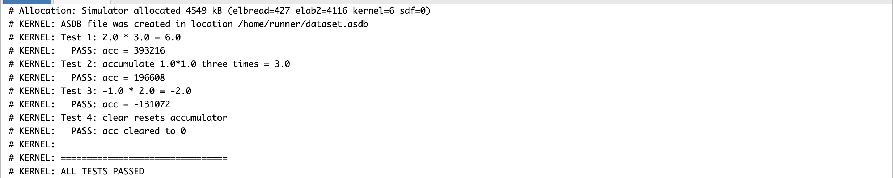
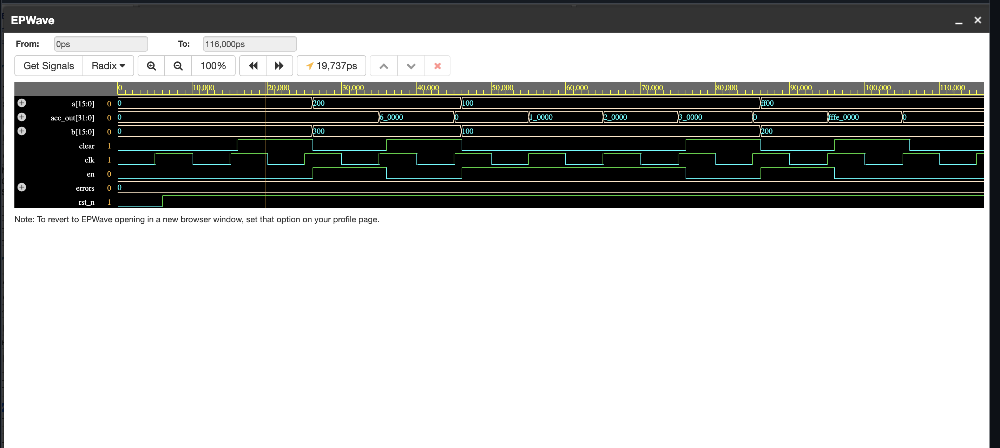
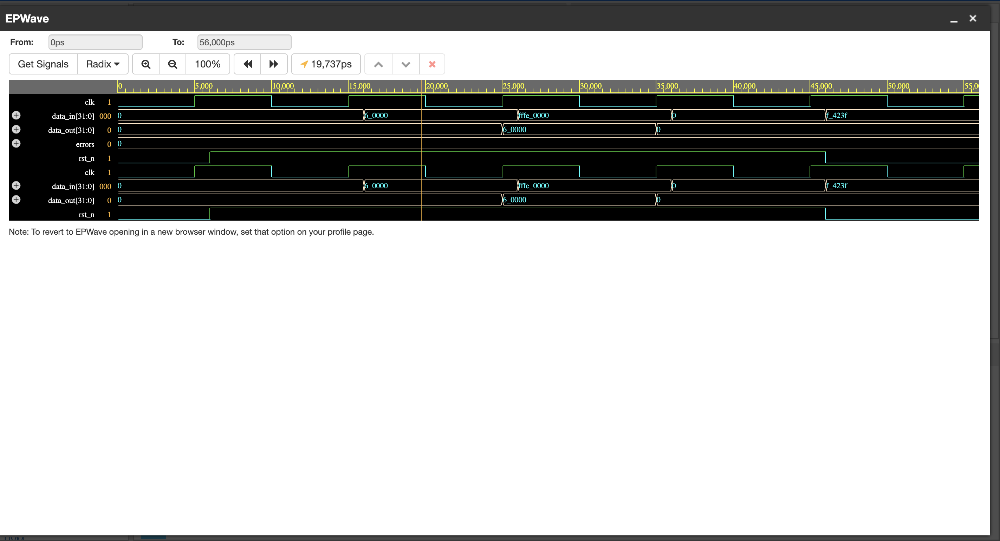
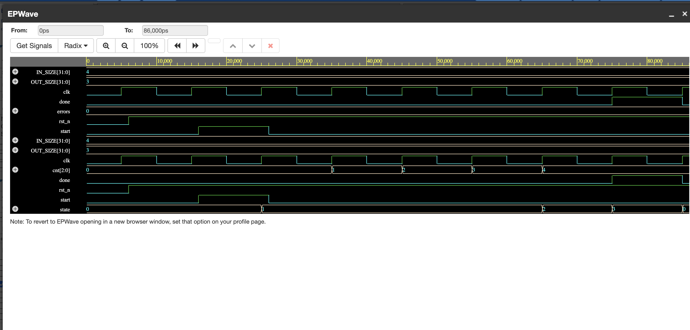
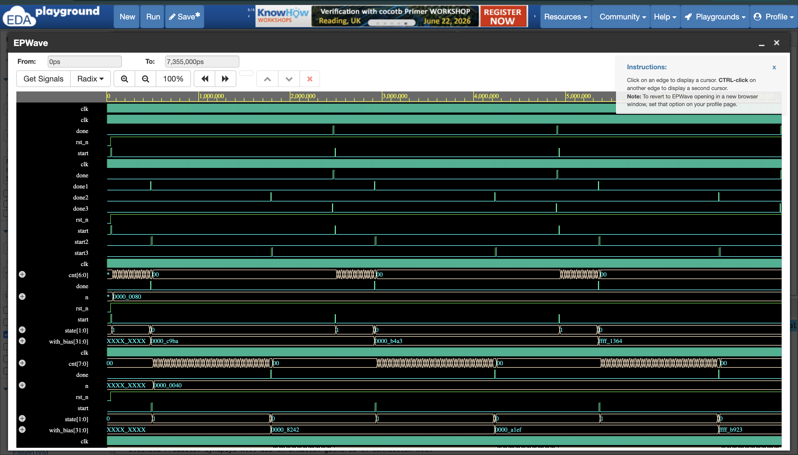
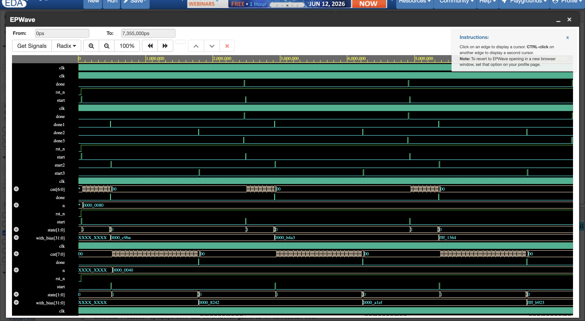
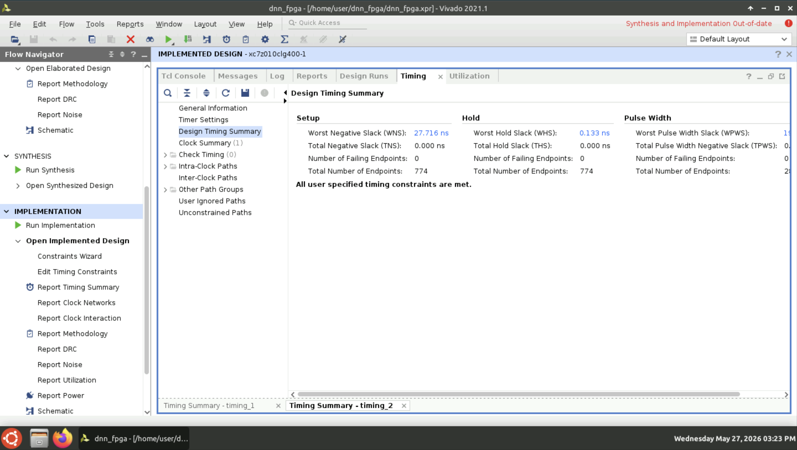
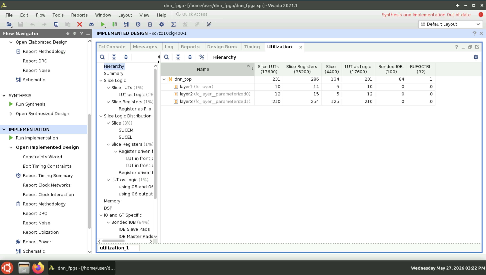

# DNN Hardware Inference Engine on FPGA
### Real-time Network Traffic Classification | NSL-KDD | Zybo Z7

> MS ECE Intern @ WINLAB | Sudeep Babasaheb Kakade

🔗 **EDA Playground:** https://www.edaplayground.com/x/EsN

---

## 🎯 Project Overview

End-to-end DNN inference engine converting a pretrained PyTorch model
to synthesizable SystemVerilog RTL, deployed on Xilinx Zybo Z7 FPGA
for real-time network intrusion detection at 404K inferences/sec.

**Pipeline:** PyTorch → Q8.8 Fixed-Point → SystemVerilog RTL → Vivado → Zybo Z7

---

## 📊 Key Results

| Metric | Value |
|--------|-------|
| Clock Frequency | 25 MHz |
| WNS | +27.716 ns ✅ |
| Inference Latency | 2.475 µs |
| Throughput | 404K inferences/sec |
| LUT Utilization | 1.31% (231/17600) |
| FF Utilization | 0.81% (286/35200) |
| Total Power | 92 mW |
| Dynamic Power | 1 mW |
| Junction Temp | 26.1°C |
| NSL-KDD Accuracy | 90% F1-score (DoS) |
| UVM Errors | 0 |
| SVA Failures | 0/6 |

---

## 🏗️ Architecture

PyTorch DNN (float32)
↓
Q8.8 Fixed-Point Quantization (max Δ < 0.000002)
↓
SystemVerilog RTL
├── mac_unit.sv       — Q8.8 multiply-accumulate
├── relu.sv           — ReLU activation
├── fc_layer.sv       — Parameterized FC (FSM)
└── dnn_top.sv        — 3-layer chain (41→128→64→5)
↓
Vivado Synthesis → Zybo Z7 (xc7z010)
---

## 📁 Repository Structure
dnn-fpga-inference/
├── python/           # PyTorch training + Q8.8 export
├── rtl/              # SystemVerilog RTL modules
├── tb/               # UVM testbench + unit tests
├── formal/           # SVA properties (dnn_props.sv)
├── weights/          # Q8.8 hex weight files
├── test_vectors/     # Input/output hex test vectors
├── vivado/           # Constraints + TCL scripts
└── docs/             # Screenshots + waveforms
---

## 📸 Results

### ✅ Unit Tests — ALL PASSED


### MAC Unit — Q8.8 Multiply-Accumulate


### ReLU — Activation Unit


### FC Layer — FSM (IDLE→COMPUTE→OUTPUT→DONE)


### DNN Top — 3-Layer Inference Chain


### UVM Simulation — done1→done2→done3 Chaining


### Vivado Timing — WNS +27.716ns ✅


### Vivado Utilization — 1.31% LUT, 0.81% FF


### Zybo Z7 Hardware — DONE LED Lit ✅


---

## 🔬 Verification Results

### UVM Simulation (Synopsys VCS X-2025.06)

UVM_INFO [MONITOR] class=1  ✅ DoS detected
UVM_INFO [MONITOR] class=1  ✅ DoS detected
UVM_INFO [MONITOR] class=0  ✅ Normal traffic
Functional Coverage = 30.0%
UVM_ERROR : 0  ✅
UVM_FATAL : 0  ✅

### SVA Formal Properties — 0 Failures

assert_done_pulses   — done pulse width = 1 cycle   ✅
assert_chain_order   — done1 → start2               ✅
assert_layer2_chain  — done2 → start3               ✅
assert_done3         — done3 → top done             ✅
assert_reset         — reset clears done            ✅
assert_no_overlap    — start/done never overlap     ✅
cover_chain: 735 attempts, 3 matches                ✅

---

## 🚀 How to Run

### 1. Train and Export Weights
```bash
cd python
pip install torch numpy pandas scikit-learn
python preprocess.py
python train.py
python export_vectors.py
```

### 2. Run UVM Simulation on EDA Playground
- Simulator: Synopsys VCS
- Design box: RTL modules + dnn_props bind
- Testbench box: UVM package + tb_uvm_top
- Upload W1.hex through b3.hex
- Run → expect 0 UVM errors, 30% coverage

### 3. Synthesize in Vivado
```tcl
open_project vivado/dnn_fpga.xpr
launch_runs impl_1 -to_step write_bitstream
write_bitstream -force dnn_top.bit
```

### 4. Program Zybo Z7
```tcl
open_hw_manager
connect_hw_server
open_hw_target
set_property PROGRAM.FILE {dnn_top.bit} [get_hw_devices xc7z010_1]
program_hw_devices [get_hw_devices xc7z010_1]
```

---

## 🛠️ Tools

| Tool | Version | Purpose |
|------|---------|---------|
| PyTorch | 2.x | DNN training |
| Synopsys VCS | X-2025.06-SP1 | UVM simulation |
| Xilinx Vivado | 2021.1 | Synthesis + P&R |
| EDA Playground | VCS | RTL verification |

---

## 👤 Author

**Sudeep Kakade**
MS ECE — Rutgers University (May 2027)
RTL Design & Verification Intern — WINLAB
[LinkedIn](https://www.linkedin.com/in/sudeep-kakade7005) |
[GitHub](https://github.com/7005-sudeep)
